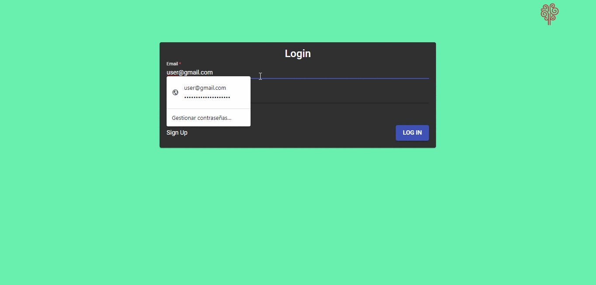

# Frontend

This is an Angular 10.0.1. Hospital Information System, it consumes NestJS web services and its deployed on GitHubPages.

## Live Demo

You can try the app by clicking here: https://tomascavataio.github.io/RS-HIS/

In order to login you can create your own user, or just use this one:

user: user@gmail.com 

password: userpassword123456789

Here you can a short demo:

## Installation

First of all you should run the command "npm install" in order to have all the dependencies locally.

## Development server

Run `ng serve` for a dev server. Navigate to `http://localhost:4200/`. The app will automatically reload if you change any of the source files.

## Code scaffolding

Run `ng generate component component-name` to generate a new component. You can also use `ng generate directive|pipe|service|class|guard|interface|enum|module`.

## Build

Run `ng build` to build the project. The build artifacts will be stored in the `dist/` directory. Use the `--prod` flag for a production build.

## Further help

To get more help on the Angular CLI use `ng help` or go check out the [Angular CLI README](https://github.com/angular/angular-cli/blob/master/README.md).
